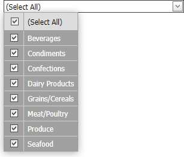

<!-- default badges list -->

[](https://supportcenter.devexpress.com/ticket/details/E4862)
[](https://docs.devexpress.com/GeneralInformation/403183)
<!-- default badges end -->

# GridLookup for ASP.NET Web Forms - How to display a custom text when all rows are selected
<!-- run online -->
**[[Run Online]](https://codecentral.devexpress.com/128530864/)**
<!-- run online end -->

This example illustrates how to display a custom text inside [ASPxGridLookup](https://docs.devexpress.com/AspNet/DevExpress.Web.ASPxGridLookup) when all its rows are selected.



To implement this scenario, follow the steps below:

1. Handle the [ASPxGridLookup.ValueChanged](http://documentation.devexpress.com/#AspNet/DevExpressWebASPxEditorsASPxEdit_ValueChangedtopic) event to pass a flag to the client. The flag indicates whether all rows are selected.

    ```js
    protected void gridLookup_ValueChanged(object sender, EventArgs e)
    {
        ASPxGridLookup gl = sender as ASPxGridLookup;
        if (gl.GridView.Selection.Count == gl.GridView.VisibleRowCount)
            gl.GridView.JSProperties["cp_selected"] = true;
    }

    ```

2. On the client, handle the [ASPxClientGridLookup.EndCallback](https://docs.devexpress.com/AspNet/js-ASPxClientGridLookup.EndCallback) event and specify a custom text if the flag returns true.


    ```js
    function OnEndCallback(s, e) {
        if (s.GetGridView().cp_selected) {
            s.GetInputElement().value = "(Select All)";
            delete (s.GetGridView().cp_selected);
        }
    }
    ```

## Files to Review

* [Default.aspx](./CS/WebSite/Default.aspx) (VB: [Default.aspx](./VB/WebSite/Default.aspx))
* [Default.aspx.cs](./CS/WebSite/Default.aspx.cs) (VB: [Default.aspx.vb](./VB/WebSite/Default.aspx.vb))
